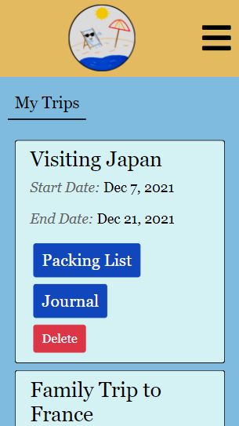
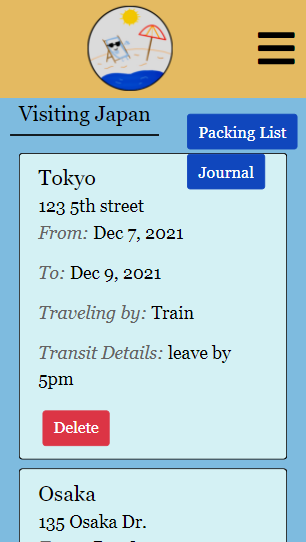
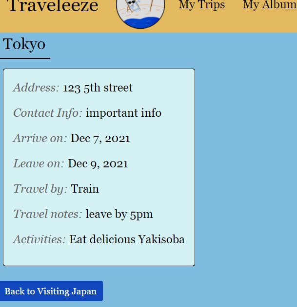

# Traveleeze

This app is a travel planner that allows authenticated users to plan their trips. Each trip is made up of multiple 'locations' and has a name, start date and end date. These locations all have their own start and end dates, along with transit details, mode of transport, and details about the activities. Each Trip also comes with a packing list that the user can add/delete to along with a journal that the user can add/delete to. Finally, the user can upload images and have them displayed in an album (NOTE: Even though this worked perfectly fine on local machines, it sadly does not work on Heroku where we have the app deployed). Please contact the devs if you happen to know a (preferably free) solution.
​
​
## Getting Started
​
* Upon loading the site, the user can log in or create an account (and then log in) 
* The user will see a list of their trips
* A new trip can be added by clicking "New Trip"
* After creating a trip, the user will be able to access the trip by clicking on it
* To add "locations" or pitstops, click "add new location"
* Users are also able to create journal entries for each trip by clicking "Add Journal"
* Users can create packing lists by clicking on "Packing List" and then "New Item"
* All trip features (trip, locations, journals, and packlists) can be deleted by clicking the delete button
​
## Deployed Link
​
Note: Due to Heroku removing their free tier, this app is no longer deployed.
​
## Screenshots
​
​
​
​
​
​
​
## Built With
​
* [HTML](https://developer.mozilla.org/en-US/docs/Web/HTML)
* [CSS](https://developer.mozilla.org/en-US/docs/Web/CSS)
* [Javascript](https://developer.mozilla.org/en-US/docs/Web/JavaScript)
* [Bootstrap](https://getbootstrap.com/)
* [Visual Studio Code](https://code.visualstudio.com/)
* [Node.js](https://nodejs.org/en/)
* [MySQL2](https://www.npmjs.com/package/mysql2)
* [Sequelize ORM](https://sequelize.org/)
* [Handlebars.js](https://handlebarsjs.com/)
* [Insomnia](https://insomnia.rest/)
* [Multer](https://www.npmjs.com/package/multer)
* [Git](https://git-scm.com/)
* [GitHub](github.com)
* [Heroku](https://id.heroku.com/)

​
## Authors
​
* **Emily Dorgan** 

- [Link to Portfolio Site](https://emdorgan.github.io/updated-portfolio/)
- [Link to Github](https://github.com/emdorgan)
- [Link to LinkedIn](https://www.linkedin.com/in/emily-dorgan/)

* **Kiri Smith** 

- [Link to Github](https://github.com/kiri-smith)
- [Link to LinkedIn](https://www.linkedin.com/in/kiri-lynne-smith/)

* **Daniel Vo** 
​
- [Link to Github](https://github.com/danielvo1)
- [Link to LinkedIn](https://www.linkedin.com/in/daniel-vo-57b00521b/)

​
## License
​
This project is licensed under the [MIT License](https://opensource.org/licenses/MIT)